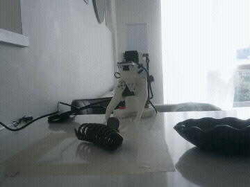
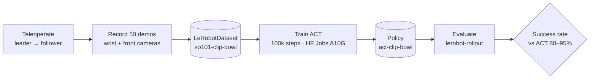
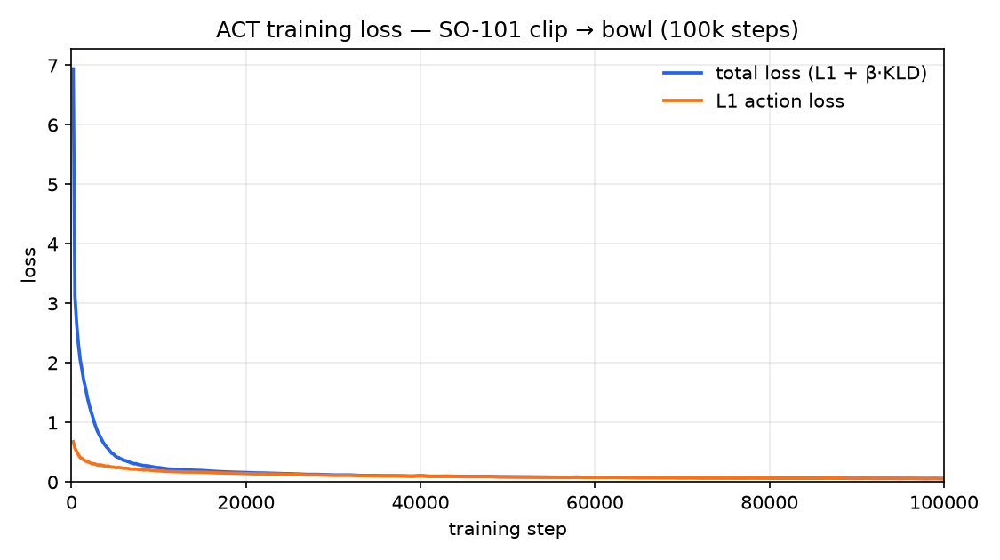

# Reproducing ACT on a low-cost SO-101 arm: clip → bowl

A reproduction of **Action Chunking with Transformers (ACT)** — from the ALOHA paper
[*Learning Fine-Grained Bimanual Manipulation with Low-Cost Hardware*](https://www.roboticsproceedings.org/rss19/p016.pdf)
(Zhao et al., RSS 2023) — on a **single [SO-101](https://huggingface.co/docs/lerobot/so101) arm**, using
[🤗 LeRobot](https://huggingface.co/docs/lerobot). 50 teleoperated demonstrations, one ACT policy, evaluated
on a real pick-and-place task: **pick up a hair clip and place it in a bowl.**

<!-- HERO MEDIA: replace with a GIF of the trained policy doing the task (see docs/reproduce.md §Media) -->
<!--  -->
> 🎥 _Hero GIF of the autonomous policy goes here._

## Result

| Metric | ACT paper (ALOHA) | This reproduction |
|---|---|---|
| Task | fine bimanual (e.g. battery insertion) | single-arm clip → bowl |
| Demonstrations | ~50 | **50** |
| Success rate | 80–95% | **50%** _(10/20 trials)_ |

> **Headline:** 10/20 successful placements (50%) — **below** the paper's 80–95% band. The policy reached the clip on every trial and coped with varied clip orientations, but grasp reliability dropped sharply away from the workspace center (6/8 near center vs 4/12 at the corners).

## What's being reproduced

The ACT paper's headline claim is that **~50 human demonstrations are enough for 80–95% task success** with
Action Chunking + Transformers, where naïve behavior cloning gets 20–50%. This project tests whether that claim
holds on the *cheapest, most constrained* setup: one SO-101, two consumer cameras, on a single-arm pick-and-place.

**Documented deviations from the paper** (this is a single-arm adaptation, not a 1:1 replication):

| Dimension | ACT paper | Here | Why it still tests the claim |
|---|---|---|---|
| Arms | 2 (bimanual ALOHA) | 1 (SO-101 follower) | Core claim (50 demos → high success) is arm-count-agnostic |
| Cameras | 4 | 2 (wrist + front) | Same observation *type* (joint state + RGB), fewer views |
| Task | fine bimanual | single-arm pick-and-place | Simpler, but requires a real precision grasp (small clip) |
| Policy | ACT | ACT (LeRobot's reference reimplementation, default hyperparameters) | Same algorithm |

## Pipeline

## Setup

- **Robot:** SO-101 (pre-assembled), 6× Feetech STS3215 servos. One follower + one leader (leader used only for data collection).
- **Cameras:** wrist-mounted 32×32 UVC module (`wrist`) + an external USB webcam for a front view (`front`), both 640×480 @ 30 fps.
- **Compute:** MacBook (Apple Silicon) for teleop / recording / eval; training on a Hugging Face Jobs **A10G** GPU.
- **Software:** LeRobot (Feetech + core_scripts extras) in a Python 3.12 `uv` venv.

<!-- MEDIA: a photo of the rig + a labeled shot of the two camera views (results/media/) -->

## Task & data

**Task string:** `"Pick up the clip and place it in the bowl"`

**Dataset:** [`khushiiw/so101-clip-bowl`](https://huggingface.co/datasets/khushiiw/so101-clip-bowl) · 50 episodes · 17,879 frames (~12 s each) · 30 fps · features: 6-DoF joint state + action, `observation.images.wrist`, `observation.images.front`.

_Collection protocol:_ the clip started at randomized positions within a fixed region; the bowl and cameras were kept fixed; the grasp was kept consistent across episodes.

<!-- MEDIA: 2–3 sample frames (wrist + front) or an embedded dataset-visualizer link -->

## Training

ACT with **LeRobot's default hyperparameters** — these *are* the reproduction (no tuning):

| Hyperparameter | Value |
|---|---|
| Vision backbone | ResNet-18 (ImageNet-pretrained) |
| Action chunk size | 100 |
| Transformer | d_model 512, 8 heads, 4 enc / 1 dec layers, FFN 3200 |
| VAE (CVAE) | enabled, latent dim 32, KL weight 10 |
| Optimizer | AdamW, lr 1e-5, weight decay 1e-4 |
| Steps / batch | 100,000 / 8 |

**Compute:** ~4.5 hours on a single A10G (100k steps). **Training loss:** total loss fell from ~6.9 → ~0.056; the L1 action-reconstruction loss went ~0.68 → ~0.055 and plateaued after ~40k steps; the KL term collapsed toward 0 (expected for a near-deterministic task, so total ≈ L1 by the end).

Log-y view of the same curve: [`results/training_curve_logy.png`](results/training_curve_logy.png) · raw points: [`results/training_metrics.csv`](results/training_metrics.csv)
> ⚠️ **Caveat that matters:** training loss correlates only weakly with real task success for these policies
> ([reference](https://www.roboticscenter.ai/tutorials/lerobot-quickstart)). The **success rate below is the real result** — the loss curve is context, not proof.

## Results & failure modes

_Success rate over 20 trials with the clip at varied start positions and orientations:_

| Outcome | Count | % |
|---|---|---|
| Placed in bowl (success) | 10 | 50% |
| Grasped but missed placement | 2 | 10% |
| Reached but failed grasp | 8 | 40% |
| Did not reach | 0 | 0% |

<!-- MEDIA: 1 success GIF + 1 representative failure GIF -->

**Observations / failure modes:**

- **Reaching is solved; grasping is the bottleneck.** The arm reached the clip on 20/20 trials but failed to close a grasp on 8 (40%). Once grasped, placement was usually clean — 10 of 12 grasps ended in the bowl.
- **Success falls off toward the workspace edges.** Near the center the policy placed **6/8 (75%)**; across the four corner positions only **4/12 (33%)**, with the top-left corner weakest (0/3). Reaching stayed reliable everywhere — it's the fine grasp that degrades off-center.
- **Orientation was not the main driver.** Successes span laying-down, upside-down, sideways, and inclined/declined clip poses — as long as the clip was near center. The policy generalized across orientation better than across position.
- **Re-grasp recovery emerged but rarely converted.** On several missed grasps the policy visibly retried (a nice side effect of action chunking); one top-left retry recovered a solid grasp, but recovery attempts seldom ended in a placement.
- **Most likely causes of the gap vs 80–95%:** (1) the 50 demonstrations concentrated coverage near the center, leaving edge positions under-represented; (2) two cameras vs the paper's four give weaker depth cues for a precise grasp at the workspace margins. Denser edge demos and/or an overhead view are the obvious next experiments.

## Reproduce it yourself

Full, copy-pasteable commands (setup → calibrate → record → train → evaluate) are in
**[docs/reproduce.md](docs/reproduce.md)**. Real-world gotchas we hit (and how to avoid them) are in
**[docs/notes.md](docs/notes.md)** — worth reading before you start.

## Links

- 📦 Training dataset: [`khushiiw/so101-clip-bowl`](https://huggingface.co/datasets/khushiiw/so101-clip-bowl)
- 🎬 Eval rollouts (20 episodes, both cameras): [`khushiiw/rollout_clip_bowl_20260812_114628`](https://huggingface.co/datasets/khushiiw/rollout_clip_bowl_20260812_114628)
- 🧠 Policy: [`khushiiw/act-clip-bowl`](https://huggingface.co/khushiiw/act-clip-bowl)
- 📄 ACT paper: [Learning Fine-Grained Bimanual Manipulation with Low-Cost Hardware](https://www.roboticsproceedings.org/rss19/p016.pdf)
- 🤗 LeRobot: [docs](https://huggingface.co/docs/lerobot) · SO-101 [assembly](https://huggingface.co/docs/lerobot/so101) · [imitation-learning tutorial](https://huggingface.co/docs/lerobot/il_robots)
