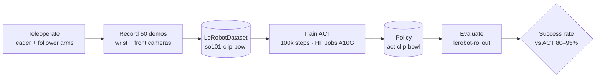
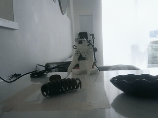

# Reproducing ACT on a low-cost SO-101 arm

A reproduction of Action Chunking with Transformers (ACT), from the ALOHA paper
[*Learning Fine-Grained Bimanual Manipulation with Low-Cost Hardware*](https://arxiv.org/abs/2304.13705)
(Zhao et al., RSS 2023), on a single [SO-101](https://huggingface.co/docs/lerobot/so101) arm, using
[🤗 LeRobot](https://huggingface.co/docs/lerobot). 

The reproduction consists of collecting 50 teleoperated demonstrations, training an ACT policy on the demonstrations, and evaluating
the policy on a real pick-and-place task: pick up a clip and place it in a bowl.

This differs from the paper in a few key ways:
* Single arm manipulation instead of bimanual
* Pick-and-place in this case is not a fine-grained task

Autonomous rollout (front camera, ~2× speed) — episode 15 of the public [eval dataset](https://huggingface.co/datasets/khushiiw/rollout_clip_bowl_20260812_114628).

## Result

| Metric | ACT paper | This reproduction |
|---|---|---|
| Task | fine bimanual (e.g. battery insertion) | single-arm pick-and-place |
| Demonstrations | 50 | **50** |
| Success rate | 65–95% | **50%** _(10/20 trials)_ |

> **Note:** 10/20 successful placements (50%) is **below** the paper's 65–95% band. The policy reached the clip on every trial and managed to succeed with varied clip orientations, but grasp reliability dropped sharply away from the workspace center (6/8 near center vs 4/12 at the corners). Observations on failure cases will be covered more in-depth below, but this is likely due to lack of sufficient diveristy in the training data.

## What's being reproduced

The ACT paper achieved 65–95% task success on fine-grained tasks with 50 demonstrations per task, where naïve behavior cloning gets 20–50%. This project tests whether that success rate holds on a constrained setup: one SO-101, two consumer cameras (wrist and front), on a single-arm pick-and-place task.

**Documented deviations from the paper**:

| Dimension | ACT paper | This reproduction | 
|---|---|---|
| Arms | 2 (bimanual ALOHA) | 1 (SO-101 follower) | 
| Cameras | 4 | 2 (wrist + front) | 
| Task | fine bimanual | single-arm pick-and-place | 
| Policy | ACT | ACT (LeRobot's reference reimplementation, default hyperparameters) |

## Pipeline

## Setup

- **Robot:** SO-101 (pre-assembled), 6× Feetech STS3215 servos. One follower + one leader (leader used only for data collection).
- **Cameras:** wrist-mounted 32×32 UVC module (`wrist`) + an external USB webcam for a front view (`front`), both 640×480 @ 30 fps.
- **Compute:** MacBook (Apple Silicon) for teleop / recording / eval; training on a Hugging Face Jobs **A10G** GPU.
- **Software:** LeRobot (Feetech + core_scripts extras) in a Python 3.12 `uv` venv.

<!-- MEDIA: a photo of the rig + a labeled shot of the two camera views (results/media/) -->

## Task & data

Task: "Pick up the clip and place it in the bowl"

Dataset: [`khushiiw/so101-clip-bowl`](https://huggingface.co/datasets/khushiiw/so101-clip-bowl) · 50 episodes · 17,879 frames (~12 s each) · 30 fps · features: 6-DoF joint state + action, `observation.images.wrist`, `observation.images.front`.

Collection protocol: the clip started at randomized positions and orientations within a fixed region; the bowl and cameras were kept fixed; the grasp was kept consistent across episodes.

<!-- MEDIA: 2–3 sample frames (wrist + front) or an embedded dataset-visualizer link -->

## Training

ACT with LeRobot's default hyperparameters:

| Hyperparameter | Value |
|---|---|
| Vision backbone | ResNet-18 (ImageNet-pretrained) |
| Action chunk size | 100 |
| Transformer | d_model 512, 8 heads, 4 enc / 1 dec layers, FFN 3200 |
| VAE (CVAE) | enabled, latent dim 32, KL weight 10 |
| Optimizer | AdamW, lr 1e-5, weight decay 1e-4 |
| Steps / batch | 100,000 / 8 |

Compute: ~4.5 hours on a single A10G (100k steps). **Training loss:** total loss fell from ~6.9 → ~0.056; the L1 action-reconstruction loss went ~0.68 → ~0.055 and plateaued after ~40k steps; the KL term collapsed toward 0 (expected for a near-deterministic task, so total ≈ L1 by the end).

Log-y view of the same curve: [`results/training_curve_logy.png`](results/training_curve_logy.png) · raw points: [`results/training_metrics.csv`](results/training_metrics.csv)

## Results & failure modes

Success rate over 20 trials with the clip at varied start positions and orientations:

| Outcome | Count | % |
|---|---|---|
| Placed in bowl (task success) | 10 | 50% |
| Grasped successfully | 12 | 60% |
| Reached successfully| 20 | 100% |

A representative failure (episode 16, ~4× speed): the clip is placed at a diagonal; the policy reaches and makes several visible re-grasp attempts, but never secures it, so nothing is placed. Contrast with the successful placement in the GIF above.

**Observations / failure modes:**

- **Reaching is solved; grasping is where the robot struggles.** The arm reached the clip on 20/20 trials but failed to close a grasp on 8 (40%). Once grasped, placement was usually clean: 10 of 12 grasps ended in the bowl.
- **Success falls off toward the workspace edges.** Near the center the policy placed 6/8 (75%); across the four corner positions only 4/12 (33%), with the top-left corner weakest (0/3). This is likely due insufficent demonstrations on the workspace edges in the training data.
- **Clip orientation was not the primary cause of failure cases.** Successes span laying-down, upside-down, sideways, and diagonal clip poses, as long as the clip was near center. The policy generalized across orientation better than across position.
- **Re-grasp recovery emerged but rarely converted into success.** On several missed grasps the policy visibly retried (a nice side effect of action chunking); one top-left retry recovered a solid grasp, but recovery attempts seldom ended in a placement. Demonstrations with re-grasp efforts and placement would likely improve success rates here.
- **Most likely causes of the success rate gap:** (1) the 50 demonstrations concentrated coverage near the center, leaving edge positions under-represented; (2) two cameras vs the paper's four give weaker depth cues for a precise grasp at the workspace margins; (3) no demonstrations with re-grasp attempts made re-grasp efforts less successful. Denser edge demos, an overhead view, and re-grasp with successful placement demos are the obvious next experiments.

## Reproduce it yourself

Full, copy-pasteable commands (setup → calibrate → record → train → evaluate) are in
[docs/reproduce.md](docs/reproduce.md). Notes on the experiment and setbacks are in
[docs/notes.md](docs/notes.md).

## Links

- Training dataset: [`khushiiw/so101-clip-bowl`](https://huggingface.co/datasets/khushiiw/so101-clip-bowl)
- Eval rollouts (20 episodes, both cameras): [`khushiiw/rollout_clip_bowl_20260812_114628`](https://huggingface.co/datasets/khushiiw/rollout_clip_bowl_20260812_114628)
- Policy: [`khushiiw/act-clip-bowl`](https://huggingface.co/khushiiw/act-clip-bowl)
- ACT paper: [Learning Fine-Grained Bimanual Manipulation with Low-Cost Hardware](https://www.roboticsproceedings.org/rss19/p016.pdf)
- 🤗 LeRobot: [docs](https://huggingface.co/docs/lerobot) · SO-101 [assembly](https://huggingface.co/docs/lerobot/so101) · [imitation-learning tutorial](https://huggingface.co/docs/lerobot/il_robots)
